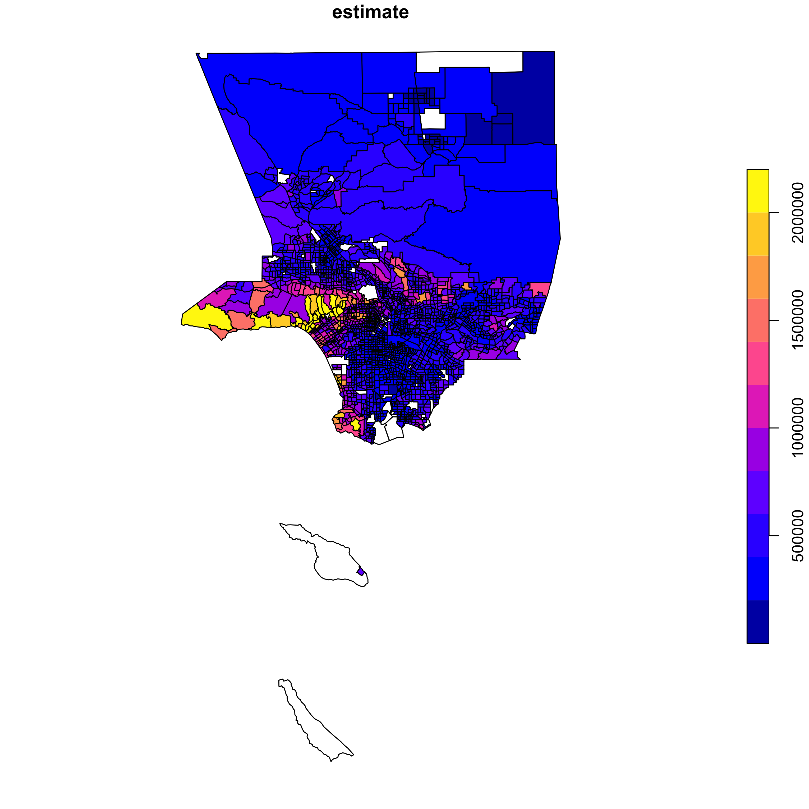

---
# Please do not edit this file directly; it is auto generated.
# Instead, please edit 10-tidycensus.md in _episodes_rmd/
title: "Using tidycensus and leaflet to map Census data"
date: 2017-06-24
slug: "using-tidycensus"
tags: [rstats]
---

NOTE: This material is taken and altered from Julia Silge's @juliasilge blog 

## What? - Demo how tidycensus works to bring data in from the Census

* Kyle Walker's [tidycensus](https://github.com/walkerke/tidycensus) R package makes it easy to bring census data into R as a dataframe.

<blockquote class="twitter-tweet" data-lang="en">
There should be a word for &quot;the regret felt when an R 📦, which would have saved untold hours of your life, is released&quot;… <a href="https://twitter.com/hashtag/rstats?src=hash">#rstats</a> 🤔 <a href="https://t.co/2THN4MwedO">https://t.co/2THN4MwedO</a>
&mdash; Mara Averick (@dataandme) <a href="https://twitter.com/dataandme/status/869968290688376832">May 31, 2017</a></blockquote>

* We'll walk through how this works in practice.  
* Before this package existed, you'd need to finda and extract or download the census data prior to reading into r. 

## Exercising my joygret

* Before running code like the following from tidycensus, you need to [obtain an API key](http://api.census.gov/data/key_signup.html) from the Census and then use the function `census_api_key()` to set it in R.
* Let's look at California population data by country. 

~~~
library(tidycensus)
census_api_key('84a27ded9e2459a6cc58d5f739003fa2824a18c2')
~~~
{: .language-r}

~~~
library(tidyverse)
library(tidycensus)

texas_pop <- get_acs(geography = "county", 
                     variables = "B01003_001", 
                     state = "CA",
                     geometry = TRUE) 
~~~
{: .language-r}

~~~

  |                                                                            
  |                                                                      |   0%
  |                                                                            
  |                                                                      |   1%
  |                                                                            
  |=                                                                     |   1%
  |                                                                            
  |=                                                                     |   2%
  |                                                                            
  |==                                                                    |   2%
  |                                                                            
  |==                                                                    |   3%
  |                                                                            
  |===                                                                   |   4%
  |                                                                            
  |===                                                                   |   5%
  |                                                                            
  |====                                                                  |   5%
  |                                                                            
  |====                                                                  |   6%
  |                                                                            
  |=====                                                                 |   6%
  |                                                                            
  |=====                                                                 |   7%
  |                                                                            
  |=====                                                                 |   8%
  |                                                                            
  |======                                                                |   8%
  |                                                                            
  |======                                                                |   9%
  |                                                                            
  |=======                                                               |   9%
  |                                                                            
  |=======                                                               |  10%
  |                                                                            
  |=======                                                               |  11%
  |                                                                            
  |========                                                              |  11%
  |                                                                            
  |========                                                              |  12%
  |                                                                            
  |=========                                                             |  12%
  |                                                                            
  |=========                                                             |  13%
  |                                                                            
  |=========                                                             |  14%
  |                                                                            
  |==========                                                            |  14%
  |                                                                            
  |==========                                                            |  15%
  |                                                                            
  |===========                                                           |  15%
  |                                                                            
  |===========                                                           |  16%
  |                                                                            
  |============                                                          |  16%
  |                                                                            
  |============                                                          |  17%
  |                                                                            
  |============                                                          |  18%
  |                                                                            
  |=============                                                         |  18%
  |                                                                            
  |=============                                                         |  19%
  |                                                                            
  |==============                                                        |  19%
  |                                                                            
  |==============                                                        |  20%
  |                                                                            
  |==============                                                        |  21%
  |                                                                            
  |===============                                                       |  21%
  |                                                                            
  |===============                                                       |  22%
  |                                                                            
  |================                                                      |  22%
  |                                                                            
  |================                                                      |  23%
  |                                                                            
  |================                                                      |  24%
  |                                                                            
  |=================                                                     |  24%
  |                                                                            
  |=================                                                     |  25%
  |                                                                            
  |==================                                                    |  25%
  |                                                                            
  |==================                                                    |  26%
  |                                                                            
  |===================                                                   |  27%
  |                                                                            
  |===================                                                   |  28%
  |                                                                            
  |====================                                                  |  28%
  |                                                                            
  |====================                                                  |  29%
  |                                                                            
  |=====================                                                 |  29%
  |                                                                            
  |=====================                                                 |  30%
  |                                                                            
  |=====================                                                 |  31%
  |                                                                            
  |======================                                                |  31%
  |                                                                            
  |======================                                                |  32%
  |                                                                            
  |=======================                                               |  32%
  |                                                                            
  |=======================                                               |  33%
  |                                                                            
  |========================                                              |  34%
  |                                                                            
  |========================                                              |  35%
  |                                                                            
  |=========================                                             |  35%
  |                                                                            
  |=========================                                             |  36%
  |                                                                            
  |==========================                                            |  36%
  |                                                                            
  |==========================                                            |  37%
  |                                                                            
  |==========================                                            |  38%
  |                                                                            
  |===========================                                           |  38%
  |                                                                            
  |===========================                                           |  39%
  |                                                                            
  |============================                                          |  39%
  |                                                                            
  |============================                                          |  40%
  |                                                                            
  |============================                                          |  41%
  |                                                                            
  |=============================                                         |  41%
  |                                                                            
  |=============================                                         |  42%
  |                                                                            
  |==============================                                        |  42%
  |                                                                            
  |==============================                                        |  43%
  |                                                                            
  |===============================                                       |  44%
  |                                                                            
  |===============================                                       |  45%
  |                                                                            
  |================================                                      |  45%
  |                                                                            
  |================================                                      |  46%
  |                                                                            
  |=================================                                     |  46%
  |                                                                            
  |=================================                                     |  47%
  |                                                                            
  |=================================                                     |  48%
  |                                                                            
  |==================================                                    |  48%
  |                                                                            
  |==================================                                    |  49%
  |                                                                            
  |===================================                                   |  49%
  |                                                                            
  |===================================                                   |  50%
  |                                                                            
  |===================================                                   |  51%
  |                                                                            
  |====================================                                  |  51%
  |                                                                            
  |====================================                                  |  52%
  |                                                                            
  |=====================================                                 |  52%
  |                                                                            
  |=====================================                                 |  53%
  |                                                                            
  |=====================================                                 |  54%
  |                                                                            
  |======================================                                |  54%
  |                                                                            
  |======================================                                |  55%
  |                                                                            
  |=======================================                               |  55%
  |                                                                            
  |=======================================                               |  56%
  |                                                                            
  |========================================                              |  57%
  |                                                                            
  |========================================                              |  58%
  |                                                                            
  |=========================================                             |  58%
  |                                                                            
  |=========================================                             |  59%
  |                                                                            
  |==========================================                            |  59%
  |                                                                            
  |==========================================                            |  60%
  |                                                                            
  |==========================================                            |  61%
  |                                                                            
  |===========================================                           |  61%
  |                                                                            
  |===========================================                           |  62%
  |                                                                            
  |============================================                          |  62%
  |                                                                            
  |============================================                          |  63%
  |                                                                            
  |============================================                          |  64%
  |                                                                            
  |=============================================                         |  64%
  |                                                                            
  |=============================================                         |  65%
  |                                                                            
  |==============================================                        |  65%
  |                                                                            
  |==============================================                        |  66%
  |                                                                            
  |===============================================                       |  67%
  |                                                                            
  |===============================================                       |  68%
  |                                                                            
  |================================================                      |  68%
  |                                                                            
  |================================================                      |  69%
  |                                                                            
  |=================================================                     |  69%
  |                                                                            
  |=================================================                     |  70%
  |                                                                            
  |=================================================                     |  71%
  |                                                                            
  |==================================================                    |  71%
  |                                                                            
  |==================================================                    |  72%
  |                                                                            
  |===================================================                   |  72%
  |                                                                            
  |===================================================                   |  73%
  |                                                                            
  |====================================================                  |  74%
  |                                                                            
  |====================================================                  |  75%
  |                                                                            
  |=====================================================                 |  75%
  |                                                                            
  |=====================================================                 |  76%
  |                                                                            
  |======================================================                |  76%
  |                                                                            
  |======================================================                |  77%
  |                                                                            
  |======================================================                |  78%
  |                                                                            
  |=======================================================               |  78%
  |                                                                            
  |=======================================================               |  79%
  |                                                                            
  |========================================================              |  79%
  |                                                                            
  |========================================================              |  80%
  |                                                                            
  |========================================================              |  81%
  |                                                                            
  |=========================================================             |  81%
  |                                                                            
  |=========================================================             |  82%
  |                                                                            
  |==========================================================            |  82%
  |                                                                            
  |==========================================================            |  83%
  |                                                                            
  |==========================================================            |  84%
  |                                                                            
  |===========================================================           |  84%
  |                                                                            
  |===========================================================           |  85%
  |                                                                            
  |============================================================          |  85%
  |                                                                            
  |============================================================          |  86%
  |                                                                            
  |=============================================================         |  86%
  |                                                                            
  |=============================================================         |  87%
  |                                                                            
  |=============================================================         |  88%
  |                                                                            
  |==============================================================        |  88%
  |                                                                            
  |==============================================================        |  89%
  |                                                                            
  |===============================================================       |  89%
  |                                                                            
  |===============================================================       |  90%
  |                                                                            
  |===============================================================       |  91%
  |                                                                            
  |================================================================      |  91%
  |                                                                            
  |================================================================      |  92%
  |                                                                            
  |=================================================================     |  92%
  |                                                                            
  |=================================================================     |  93%
  |                                                                            
  |=================================================================     |  94%
  |                                                                            
  |==================================================================    |  94%
  |                                                                            
  |==================================================================    |  95%
  |                                                                            
  |===================================================================   |  95%
  |                                                                            
  |===================================================================   |  96%
  |                                                                            
  |====================================================================  |  97%
  |                                                                            
  |====================================================================  |  98%
  |                                                                            
  |===================================================================== |  98%
  |                                                                            
  |===================================================================== |  99%
  |                                                                            
  |======================================================================|  99%
  |                                                                            
  |======================================================================| 100%
~~~
{: .output}

~~~
texas_pop
~~~
{: .language-r}

~~~
Simple feature collection with 58 features and 5 fields
geometry type:  MULTIPOLYGON
dimension:      XY
bbox:           xmin: -124.4096 ymin: 32.53416 xmax: -114.1312 ymax: 42.00952
epsg (SRID):    4269
proj4string:    +proj=longlat +ellps=GRS80 +towgs84=0,0,0,0,0,0,0 +no_defs
First 10 features:
   GEOID                            NAME   variable estimate moe
1  06001      Alameda County, California B01003_001  1629615  NA
2  06003       Alpine County, California B01003_001     1203 179
3  06005       Amador County, California B01003_001    37306  NA
4  06007        Butte County, California B01003_001   225207  NA
5  06009    Calaveras County, California B01003_001    45057  NA
6  06011       Colusa County, California B01003_001    21479  NA
7  06013 Contra Costa County, California B01003_001  1123678  NA
8  06015    Del Norte County, California B01003_001    27442  NA
9  06017    El Dorado County, California B01003_001   185015  NA
10 06019       Fresno County, California B01003_001   971616  NA
                         geometry
1  MULTIPOLYGON (((-122.3423 3...
2  MULTIPOLYGON (((-120.0724 3...
3  MULTIPOLYGON (((-121.0274 3...
4  MULTIPOLYGON (((-122.0687 3...
5  MULTIPOLYGON (((-120.9936 3...
6  MULTIPOLYGON (((-122.7851 3...
7  MULTIPOLYGON (((-122.4298 3...
8  MULTIPOLYGON (((-124.2175 4...
9  MULTIPOLYGON (((-121.141 38...
10 MULTIPOLYGON (((-120.9094 3...
~~~
{: .output}

* The total population in each county in Texas, in a tidyverse-ready data frame.
* If you want to get information for multiple states, [just use purrr](https://walkerke.github.io/2017/05/tidycensus-every-tract/). 
* The US Census tabulates lots of [important kinds of information](https://www.census.gov/programs-surveys/acs/guidance/subjects.html) here in the United States, although there has been troubling [uncertainty](https://www.theatlantic.com/politics/archive/2017/05/census-director-resigns-2020-funding-concern/526107/) about [leadership and funding](https://www.washingtonpost.com/local/social-issues/us-census-director-resigns-amid-turmoil-over-funding-of-2020-count/2017/05/09/8f8657c6-34ea-11e7-b412-62beef8121f7_story.html) there in recent months.

* So we have this data in a form that will be easy to manipulate; what if we want to map it? 
* Kyle Walker again has this taken care of, with his tigris package (a dependency of tidycensus); if you set `geometry = TRUE` the way that I did when I downloaded the Census data above, tigris handles downloading the shapefiles from the Census, with support for `sf` [simple features](https://github.com/edzer/sfr). 
* Kyle has a vignette for [mapping using ggplot2](https://walkerke.github.io/tidycensus/articles/spatial-data.html), but you can also pipe straight into leaflet.

~~~
library(leaflet)
library(stringr)
library(sf)

pal <- colorQuantile(palette = "viridis", domain = texas_pop$estimate, n = 10)

texas_pop %>%
    st_transform(crs = "+init=epsg:4326") %>%
    leaflet(width = "100%") %>%
    addProviderTiles(provider = "CartoDB.Positron") %>%
    addPolygons(popup = ~ str_extract(NAME, "^([^,]*)"),
                stroke = FALSE,
                smoothFactor = 0,
                fillOpacity = 0.7,
                color = ~ pal(estimate)) %>%
    addLegend("bottomright", 
              pal = pal, 
              values = ~ estimate,
              title = "Population percentiles",
              opacity = 1)
~~~
{: .language-r}

~~~
Error in file(con, "rb"): cannot open the connection
~~~
{: .error}

**What is that `st_transform` doing?**

* It is doing a projection onto a certain reference system of the spatial information contained in the `sf` column.
* The specific choice of an [EPSG code of 4326](https://gis.stackexchange.com/questions/3334/what-is-the-difference-between-wgs84-and-epsg4326) is for a given projection.

## A couple more examples

* Let's look at the counties in Utah (where I live) while we're at it. Let's map color to population here, instead of quantiles, just for something different.

~~~
utah_pop <- get_acs(geography = "county", 
                    variables = "B01003_001", 
                    state = "UT",
                    geometry = TRUE)

pal <- colorNumeric(palette = "plasma", 
                    domain = utah_pop$estimate)

utah_pop %>%
    st_transform(crs = "+init=epsg:4326") %>%
    leaflet(width = "100%") %>%
    addProviderTiles(provider = "CartoDB.Positron") %>%
    addPolygons(popup = ~ str_extract(NAME, "^([^,]*)"),
                stroke = FALSE,
                smoothFactor = 0,
                fillOpacity = 0.7,
                color = ~ pal(estimate)) %>%
    addLegend("bottomright", 
              pal = pal, 
              values = ~ estimate,
              title = "County Populations",
              opacity = 1)
~~~
{: .language-r}

~~~
Error in file(con, "rb"): cannot open the connection
~~~
{: .error}

Yep, that is right, although still remarkable to me. Utah is largely an extremely rural state, with lots of people here in Salt Lake City where I live and then in the corridor to the north and south.

There is so much other information available from the Census. For example, what if I want to look at the median home value in Salt Lake County, at the census tract level?

~~~
slc_value <- get_acs(geography = "tract", 
                    variables = "B25077_001", 
                    state = "UT",
                    county = "Salt Lake County",
                    geometry = TRUE)
~~~
{: .language-r}

~~~

  |                                                                            
  |                                                                      |   0%
  |                                                                            
  |==                                                                    |   3%
  |                                                                            
  |===                                                                   |   4%
  |                                                                            
  |=====                                                                 |   7%
  |                                                                            
  |======                                                                |   9%
  |                                                                            
  |========                                                              |  11%
  |                                                                            
  |=========                                                             |  13%
  |                                                                            
  |==========                                                            |  14%
  |                                                                            
  |============                                                          |  17%
  |                                                                            
  |=============                                                         |  19%
  |                                                                            
  |===============                                                       |  22%
  |                                                                            
  |=================                                                     |  24%
  |                                                                            
  |===================                                                   |  26%
  |                                                                            
  |===================                                                   |  28%
  |                                                                            
  |=====================                                                 |  31%
  |                                                                            
  |======================                                                |  32%
  |                                                                            
  |========================                                              |  35%
  |                                                                            
  |=========================                                             |  36%
  |                                                                            
  |===========================                                           |  39%
  |                                                                            
  |============================                                          |  40%
  |                                                                            
  |==============================                                        |  43%
  |                                                                            
  |================================                                      |  46%
  |                                                                            
  |=================================                                     |  48%
  |                                                                            
  |===================================                                   |  51%
  |                                                                            
  |====================================                                  |  52%
  |                                                                            
  |=====================================                                 |  53%
  |                                                                            
  |=======================================                               |  55%
  |                                                                            
  |========================================                              |  57%
  |                                                                            
  |==========================================                            |  60%
  |                                                                            
  |============================================                          |  62%
  |                                                                            
  |=============================================                         |  65%
  |                                                                            
  |==============================================                        |  66%
  |                                                                            
  |===============================================                       |  67%
  |                                                                            
  |=================================================                     |  70%
  |                                                                            
  |==================================================                    |  72%
  |                                                                            
  |====================================================                  |  75%
  |                                                                            
  |======================================================                |  77%
  |                                                                            
  |========================================================              |  79%
  |                                                                            
  |=========================================================             |  81%
  |                                                                            
  |===========================================================           |  84%
  |                                                                            
  |============================================================          |  86%
  |                                                                            
  |==============================================================        |  89%
  |                                                                            
  |================================================================      |  91%
  |                                                                            
  |==================================================================    |  94%
  |                                                                            
  |===================================================================   |  95%
  |                                                                            
  |===================================================================   |  96%
  |                                                                            
  |===================================================================== |  99%
  |                                                                            
  |======================================================================| 100%
~~~
{: .output}

~~~
pal <- colorNumeric(palette = "viridis", 
                    domain = slc_value$estimate)

slc_value %>%
    st_transform(crs = "+init=epsg:4326") %>%
    leaflet(width = "100%") %>%
    addProviderTiles(provider = "CartoDB.Positron") %>%
    addPolygons(popup = ~ str_extract(NAME, "^([^,]*)"),
                stroke = FALSE,
                smoothFactor = 0,
                fillOpacity = 0.7,
                color = ~ pal(estimate)) %>%
    addLegend("bottomright", 
              pal = pal, 
              values = ~ estimate,
              title = "Median Home Value",
              labFormat = labelFormat(prefix = "$"),
              opacity = 1)
~~~
{: .language-r}

~~~
Error in file(con, "rb"): cannot open the connection
~~~
{: .error}

The two census tracts with `NA` values are the airport on the west side and the University of Utah on the east side. You can very obviously see the east-to-west gradient that comes as no surprise to us locals, and that priciest tract is up against one of the canyons with beautiful views. But mainly please notice with what ease I made this interactive map!

~~~
library(tidycensus)
library(tidyverse)
library(sf)

# Get dataset with geometry set to TRUE
orange_value <- get_acs(geography = "tract", state = "CA", 
                    county = "Los Angeles", 
                    variables = "B25077_001", 
                    geometry = TRUE)
~~~
{: .language-r}

~~~

  |                                                                            
  |                                                                      |   0%
  |                                                                            
  |                                                                      |   1%
  |                                                                            
  |=                                                                     |   1%
  |                                                                            
  |=                                                                     |   2%
  |                                                                            
  |==                                                                    |   2%
  |                                                                            
  |==                                                                    |   3%
  |                                                                            
  |===                                                                   |   4%
  |                                                                            
  |===                                                                   |   5%
  |                                                                            
  |====                                                                  |   5%
  |                                                                            
  |====                                                                  |   6%
  |                                                                            
  |=====                                                                 |   7%
  |                                                                            
  |======                                                                |   8%
  |                                                                            
  |======                                                                |   9%
  |                                                                            
  |=======                                                               |  10%
  |                                                                            
  |=======                                                               |  11%
  |                                                                            
  |========                                                              |  11%
  |                                                                            
  |========                                                              |  12%
  |                                                                            
  |=========                                                             |  12%
  |                                                                            
  |=========                                                             |  13%
  |                                                                            
  |==========                                                            |  14%
  |                                                                            
  |==========                                                            |  15%
  |                                                                            
  |===========                                                           |  15%
  |                                                                            
  |===========                                                           |  16%
  |                                                                            
  |============                                                          |  16%
  |                                                                            
  |============                                                          |  17%
  |                                                                            
  |============                                                          |  18%
  |                                                                            
  |=============                                                         |  18%
  |                                                                            
  |=============                                                         |  19%
  |                                                                            
  |==============                                                        |  19%
  |                                                                            
  |==============                                                        |  20%
  |                                                                            
  |==============                                                        |  21%
  |                                                                            
  |===============                                                       |  21%
  |                                                                            
  |===============                                                       |  22%
  |                                                                            
  |================                                                      |  22%
  |                                                                            
  |================                                                      |  23%
  |                                                                            
  |=================                                                     |  24%
  |                                                                            
  |=================                                                     |  25%
  |                                                                            
  |==================                                                    |  25%
  |                                                                            
  |==================                                                    |  26%
  |                                                                            
  |===================                                                   |  27%
  |                                                                            
  |===================                                                   |  28%
  |                                                                            
  |====================                                                  |  28%
  |                                                                            
  |====================                                                  |  29%
  |                                                                            
  |=====================                                                 |  30%
  |                                                                            
  |=====================                                                 |  31%
  |                                                                            
  |======================                                                |  31%
  |                                                                            
  |======================                                                |  32%
  |                                                                            
  |=======================                                               |  32%
  |                                                                            
  |=======================                                               |  33%
  |                                                                            
  |========================                                              |  34%
  |                                                                            
  |========================                                              |  35%
  |                                                                            
  |=========================                                             |  35%
  |                                                                            
  |=========================                                             |  36%
  |                                                                            
  |==========================                                            |  37%
  |                                                                            
  |==========================                                            |  38%
  |                                                                            
  |===========================                                           |  38%
  |                                                                            
  |===========================                                           |  39%
  |                                                                            
  |============================                                          |  39%
  |                                                                            
  |============================                                          |  40%
  |                                                                            
  |=============================                                         |  41%
  |                                                                            
  |=============================                                         |  42%
  |                                                                            
  |==============================                                        |  42%
  |                                                                            
  |==============================                                        |  43%
  |                                                                            
  |===============================                                       |  44%
  |                                                                            
  |===============================                                       |  45%
  |                                                                            
  |================================                                      |  45%
  |                                                                            
  |================================                                      |  46%
  |                                                                            
  |=================================                                     |  47%
  |                                                                            
  |=================================                                     |  48%
  |                                                                            
  |==================================                                    |  48%
  |                                                                            
  |==================================                                    |  49%
  |                                                                            
  |===================================                                   |  49%
  |                                                                            
  |===================================                                   |  50%
  |                                                                            
  |===================================                                   |  51%
  |                                                                            
  |====================================                                  |  51%
  |                                                                            
  |====================================                                  |  52%
  |                                                                            
  |=====================================                                 |  52%
  |                                                                            
  |=====================================                                 |  53%
  |                                                                            
  |=====================================                                 |  54%
  |                                                                            
  |======================================                                |  54%
  |                                                                            
  |======================================                                |  55%
  |                                                                            
  |=======================================                               |  55%
  |                                                                            
  |=======================================                               |  56%
  |                                                                            
  |========================================                              |  57%
  |                                                                            
  |========================================                              |  58%
  |                                                                            
  |=========================================                             |  58%
  |                                                                            
  |=========================================                             |  59%
  |                                                                            
  |==========================================                            |  60%
  |                                                                            
  |===========================================                           |  61%
  |                                                                            
  |===========================================                           |  62%
  |                                                                            
  |============================================                          |  62%
  |                                                                            
  |============================================                          |  63%
  |                                                                            
  |=============================================                         |  64%
  |                                                                            
  |=============================================                         |  65%
  |                                                                            
  |==============================================                        |  65%
  |                                                                            
  |==============================================                        |  66%
  |                                                                            
  |===============================================                       |  67%
  |                                                                            
  |===============================================                       |  68%
  |                                                                            
  |================================================                      |  68%
  |                                                                            
  |================================================                      |  69%
  |                                                                            
  |=================================================                     |  69%
  |                                                                            
  |=================================================                     |  70%
  |                                                                            
  |==================================================                    |  71%
  |                                                                            
  |==================================================                    |  72%
  |                                                                            
  |===================================================                   |  72%
  |                                                                            
  |===================================================                   |  73%
  |                                                                            
  |====================================================                  |  74%
  |                                                                            
  |====================================================                  |  75%
  |                                                                            
  |=====================================================                 |  75%
  |                                                                            
  |=====================================================                 |  76%
  |                                                                            
  |======================================================                |  76%
  |                                                                            
  |======================================================                |  77%
  |                                                                            
  |======================================================                |  78%
  |                                                                            
  |=======================================================               |  78%
  |                                                                            
  |=======================================================               |  79%
  |                                                                            
  |========================================================              |  79%
  |                                                                            
  |========================================================              |  80%
  |                                                                            
  |========================================================              |  81%
  |                                                                            
  |=========================================================             |  81%
  |                                                                            
  |=========================================================             |  82%
  |                                                                            
  |==========================================================            |  82%
  |                                                                            
  |==========================================================            |  83%
  |                                                                            
  |==========================================================            |  84%
  |                                                                            
  |===========================================================           |  84%
  |                                                                            
  |===========================================================           |  85%
  |                                                                            
  |============================================================          |  85%
  |                                                                            
  |============================================================          |  86%
  |                                                                            
  |=============================================================         |  87%
  |                                                                            
  |=============================================================         |  88%
  |                                                                            
  |==============================================================        |  88%
  |                                                                            
  |==============================================================        |  89%
  |                                                                            
  |===============================================================       |  90%
  |                                                                            
  |===============================================================       |  91%
  |                                                                            
  |================================================================      |  91%
  |                                                                            
  |================================================================      |  92%
  |                                                                            
  |=================================================================     |  92%
  |                                                                            
  |=================================================================     |  93%
  |                                                                            
  |==================================================================    |  94%
  |                                                                            
  |==================================================================    |  95%
  |                                                                            
  |===================================================================   |  95%
  |                                                                            
  |===================================================================   |  96%
  |                                                                            
  |====================================================================  |  97%
  |                                                                            
  |====================================================================  |  98%
  |                                                                            
  |===================================================================== |  98%
  |                                                                            
  |===================================================================== |  99%
  |                                                                            
  |======================================================================| 100%
~~~
{: .output}

~~~
# Plot the estimate to view a map of the data
plot(orange_value["estimate"])
~~~
{: .language-r}

